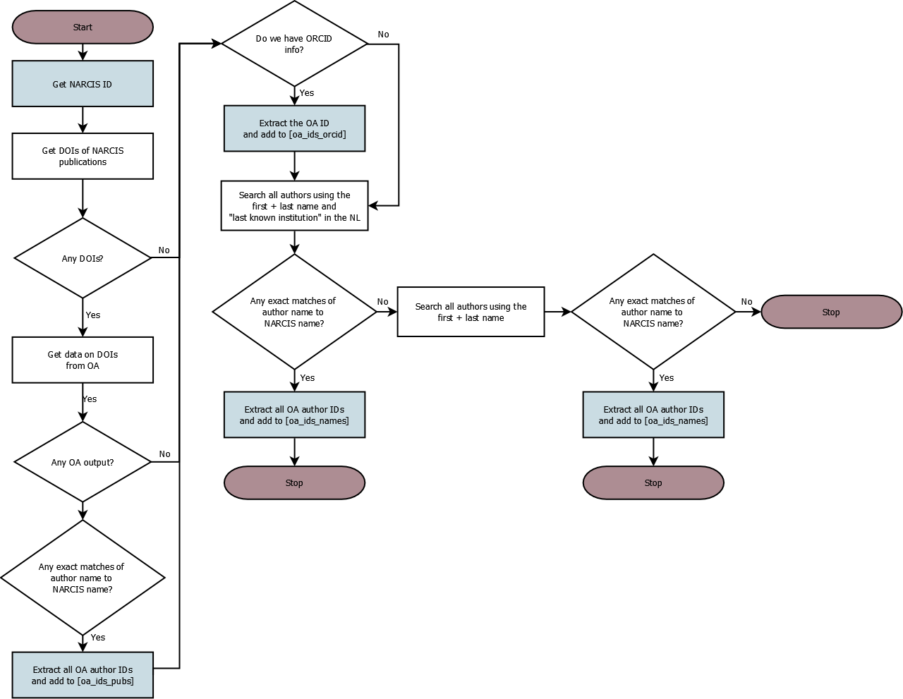
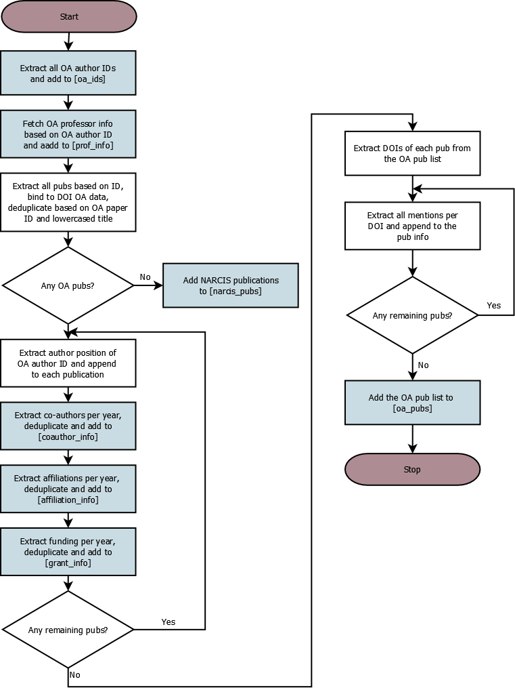

This script uses OpenAlex and Altmetric databases  to download data on professors in our sample.

```{r include=FALSE}
knitr::opts_chunk$set(echo = TRUE)
knitr::opts_chunk$set(eval = FALSE)
knitr::opts_chunk$set(warning = FALSE)
knitr::opts_chunk$set(message = FALSE)
```

Load the necessary packages:
```{r message=  F, warning = F, eval = T}
library(groundhog)
packages_to_load <- c("readr", "dplyr", "openalexR",
                      "ggplot2", "stringr", "tidyr",
                      "jsonlite", "xml2", "tidyverse",
                      "RPostgres", "lubridate","digest",
                      "DBI", "RODBC", "odbc")
groundhog.library(packages_to_load, date = "2023-12-01")

# we've also added our email to the "polite pool" of OpenAlex by
# adding a line in the .Rprofile

# load the helper function file
source("helper_functions.R")
```

Connect to our database:
```{r}
port <- 
user <- ""
password <- ""
database_name <- ""

con <- RPostgres::dbConnect(RPostgres::Postgres(),
                 dbname= database_name,
                 port = port,
                 user = user, 
                 password = password)

con # Checks connection is working
```


# Tidy up professor data from NARCIS

Load the professor profiles:
```{r message = F, warning = F}
load("raw_data/media_profs_profiles.rda")
profs <- read_csv("raw_data/dutch_profs_urls.csv")

# merge the profs with their ORCIDs
colnames(profs)[c(1,7)] <- c("id", "profile_id")

profs_full <- merge(profs,
                    metadf[, c(1:4, 361)],
                    by = "profile_id")

# Write this out into our DB
#dbWriteTable(con, "narcis_prof_info", profs_full, row.names=FALSE, append=TRUE)
```

Check for professors with duplicate names:
```{r}
profs_full_dupl <- profs_full
profs_full_dupl$dupl <- duplicated(profs_full_dupl$full)
dupl_names <- filter(profs_full_dupl, dupl == TRUE)$full


profs_duplicates <- filter(profs_full_dupl, full %in% dupl_names)
```


# Tidy up the publication data from NARCIS
Load the publication data:
```{r}
# fetch the papers
load("~/Postdoc/Projects/dutch_media_profs_r/raw_data/media_profs_pubs.rda")
# match the publication data to authorships
load("~/Postdoc/Projects/dutch_media_profs_r/raw_data/media_profs_pub_to_profile_ids.rda")
colnames(pub_to_profile_id)[1] <- "narcis_url"

prof_pubs_full <- merge(pubs_metadf[, c(1:23)],
                        pub_to_profile_id,
                        by = "narcis_url")
# strip the last / from the profile ids here
prof_pubs_full$profile_id <- str_sub(prof_pubs_full$profile_id, end = -2)

# tidy up some misbehaving DOIs
prof_pubs_full$n_words <- str_count(prof_pubs_full$DOI, " ")

# let's manually fix them since there are so few problematic ones
pubs_doi_words <- filter(prof_pubs_full, n_words > 0)
# these are just the DOIs where we have manually removed the spaces or redundant text
pubs_doi_words$DOI <- c("10.1016/j.jhydrol.2011.03.047", "10.1111/j.1365-3091.2012.01365.x",   
                         "10.1120/jacmp.v17i4.6117", "10.22203/ecm.v032a11",  
                         "10.22203/ecm.v032a11", "10.1167/iovs.16-20799",  
                         "10.1136/bmjsem-2018-000427", "10.1111/hae.12353",
                         "10.1128/iai.64.10.4220-4225.1996", "10.1039/b302097e",       
                         "10.1039/b302097e", "10.1016/s0016-5085(19)38052-7",
                         "10.1039/b209378b", "10.3850/978-981-07-2615-7-290",      
                         "10.3850/978-981-07-2615-7 289", "10.1016/s0040-6090(96)09248-6",    
                         "10.1061(asce)mt.1943-5533.0002169", "10.1371/journal.pone.0059600",     
                         "10.1371/journal.pone.0059600", "10.1371/journal.pone.0059600",     
                         "10.1109/isbi.2016.7493532", "10.1109/isbi.2016.7493532",         
                         "10.1109/isbi.2016.7493532", "10.1109/isbi.2016.7493532",         
                         "10.1109/isbi.2016.7493532", "10.1080/03797720120082651",         
                         "10.3850/978-981-11-2724-3_0641-cd", "10.3850/978-981-11-2724-3_0641-cd", 
                         "10.3850/978-981-11-2724-3_0596-cd", "10.1136/bmjopen-2017-016077",       
                         "10.1103/physrevlett.115.159901", "10.1515/lingvan-2016-0048",         
                         "10.1108/jfrc-07-2018-0103", "10.1097/01.brs.0000206381.15224.0",
                         "10.1080/21507740.2016.1251990", "10.1021/ie0492449 s0888-5885(04)09244-9",  
                         "10.1021/ie0492449 s0888-5885(04)09244-9", "10.2478/v10304-012-0011-y",   
                         "10.1007/s10853-011-5682-6", "10.1021/ja0455650s0002-7863(04)05565-9",   
                         "10.1021/jo0401220-s0022-3263(04)00122-7","10.1007/s10103-008-0626-3",  
                         "10.1371/journal.pone.0216743", "10.1177/0021886316672724",         
                         "10.5194/se-10-517-2019", "10.18690/978-961-286-061-5.3",      
                         "10.18690/978-961-286-061-5.3", "10.3850/978-981-11-2724-3_0441-cd", 
                         "10.3850/978-981-11-2725-0-is3-5-cd", "10.3390/atmos12121633",  
                         "10.3850/978-981-14-8593-0-4139-cd", "10.3850/978-981-11-2724-3_0248-cd") 
# fix the pub list
# filter out the problematic dois
prof_pubs_full_fix <- filter(prof_pubs_full, (is.na(n_words)|n_words == 0))
# and then put them back
prof_pubs_full <- rbind(prof_pubs_full_fix,
                        pubs_doi_words)


# drop large files from the memory as we don't need them anymore
rm(pubs_metadf)
rm(metadf)
rm(pub_to_profile_id)
gc()

# Write this out into our DB
#dbWriteTable(con, "narcis_pub_info", prof_pubs_full, row.names=FALSE, append=TRUE)
```

# OA data

## Seek professor identifiers in OpenAlex

Define the function that helps us seek identifiers from:
1. Professor's Narcis publication list (based on DOI)
2. Professor's ORCID as in Narcis
3. Professor's name + NL as the country of their last known institution

This diagram describes how we do it:


Loop through professors and find their identifiers:
```{r}
narcis_ids <- profs_full$profile_id
prof_identifier_list <- list()

for (i in 1:length(narcis_ids)){
  narcis_id <- narcis_ids[i]
  
  prof_ids <- NA
  
  try(prof_ids <- professor_identifier_retriever(narcis_id,
                                                 pub_data = prof_pubs_full,
                                                 prof_data = profs_full)
  )
  
  prof_identifier_list[[i]] <- prof_ids
  names(prof_identifier_list)[[i]] <- narcis_id
  
  print(paste("done with", i, "out of", length(narcis_ids)))
  
}
```

We fail to find any OA ids for some professors.
Find their OA IDs manually:
```{r}
# manually get the correct search terms for the missing professors:
missing_ids <- c("https://www.narcis.nl/person/RecordID/PRS1236634",
                 "https://www.narcis.nl/person/RecordID/PRS1236869",
                 "https://www.narcis.nl/person/RecordID/PRS1236960",
                 "https://www.narcis.nl/person/RecordID/PRS1237850",
                 "https://www.narcis.nl/person/RecordID/PRS1238045",
                 "https://www.narcis.nl/person/RecordID/PRS1238542",
                 "https://www.narcis.nl/person/RecordID/PRS1238880",
                 "https://www.narcis.nl/person/RecordID/PRS1238898",
                 "https://www.narcis.nl/person/RecordID/PRS1239122",
                 "https://www.narcis.nl/person/RecordID/PRS1239606",
                 "https://www.narcis.nl/person/RecordID/PRS1239841",
                 "https://www.narcis.nl/person/RecordID/PRS1240194",
                 "https://www.narcis.nl/person/RecordID/PRS1241218",
                 "https://www.narcis.nl/person/RecordID/PRS1241266",
                 "https://www.narcis.nl/person/RecordID/PRS1241562",
                 "https://www.narcis.nl/person/RecordID/PRS1241837",
                 "https://www.narcis.nl/person/RecordID/PRS1242035",
                 "https://www.narcis.nl/person/RecordID/PRS1242243",
                 "https://www.narcis.nl/person/RecordID/PRS1243109",
                 "https://www.narcis.nl/person/RecordID/PRS1247112",
                 "https://www.narcis.nl/person/RecordID/PRS1251650",
                 "https://www.narcis.nl/person/RecordID/PRS1253801",
                 "https://www.narcis.nl/person/RecordID/PRS1255909",
                 "https://www.narcis.nl/person/RecordID/PRS1263017",
                 "https://www.narcis.nl/person/RecordID/PRS1265503",
                 "https://www.narcis.nl/person/RecordID/PRS1273858",
                 "https://www.narcis.nl/person/RecordID/PRS1276448",
                 "https://www.narcis.nl/person/RecordID/PRS1281844",
                 "https://www.narcis.nl/person/RecordID/PRS1281845",
                 "https://www.narcis.nl/person/RecordID/PRS1281875",
                 "https://www.narcis.nl/person/RecordID/PRS1283984",
                 "https://www.narcis.nl/person/RecordID/PRS1286354",
                 "https://www.narcis.nl/person/RecordID/PRS1288340",
                 "https://www.narcis.nl/person/RecordID/PRS1288550",
                 "https://www.narcis.nl/person/RecordID/PRS1289299",
                 "https://www.narcis.nl/person/RecordID/PRS1291051",
                 "https://www.narcis.nl/person/RecordID/PRS1291919",
                 "https://www.narcis.nl/person/RecordID/PRS1291938",
                 "https://www.narcis.nl/person/RecordID/PRS1295469",
                 "https://www.narcis.nl/person/RecordID/PRS1295569",
                 "https://www.narcis.nl/person/RecordID/PRS1296313",
                 "https://www.narcis.nl/person/RecordID/PRS1297223",
                 "https://www.narcis.nl/person/RecordID/PRS1297929",
                 "https://www.narcis.nl/person/RecordID/PRS1300768",
                 "https://www.narcis.nl/person/RecordID/PRS1303552",
                 "https://www.narcis.nl/person/RecordID/PRS1304651",
                 "https://www.narcis.nl/person/RecordID/PRS1313781",
                 "https://www.narcis.nl/person/RecordID/PRS1314178",
                 "https://www.narcis.nl/person/RecordID/PRS1316068",
                 "https://www.narcis.nl/person/RecordID/PRS1317806",
                 "https://www.narcis.nl/person/RecordID/PRS1319241",
                 "https://www.narcis.nl/person/RecordID/PRS1319812",
                 "https://www.narcis.nl/person/RecordID/PRS1320174",
                 "https://www.narcis.nl/person/RecordID/PRS1321103",
                 "https://www.narcis.nl/person/RecordID/PRS1324160",
                 "https://www.narcis.nl/person/RecordID/PRS1325120",
                 "https://www.narcis.nl/person/RecordID/PRS1329166",
                 "https://www.narcis.nl/person/RecordID/PRS1331360",
                 "https://www.narcis.nl/person/RecordID/PRS1331452",
                 "https://www.narcis.nl/person/RecordID/PRS1333614",
                 "https://www.narcis.nl/person/RecordID/PRS1333801",
                 "https://www.narcis.nl/person/RecordID/PRS1334043",
                 "https://www.narcis.nl/person/RecordID/PRS1335654",
                 "https://www.narcis.nl/person/RecordID/PRS1335659",
                 "https://www.narcis.nl/person/RecordID/PRS1336365",
                 "https://www.narcis.nl/person/RecordID/PRS1336549",
                 "https://www.narcis.nl/person/RecordID/PRS1340887",
                 "https://www.narcis.nl/person/RecordID/PRS1340978",
                 "https://www.narcis.nl/person/RecordID/PRS1341557",
                 "https://www.narcis.nl/person/RecordID/PRS1342181",
                 "https://www.narcis.nl/person/RecordID/PRS1342195",
                 "https://www.narcis.nl/person/RecordID/PRS1342275",
                 "https://www.narcis.nl/person/RecordID/PRS1347897",
                 "https://www.narcis.nl/person/RecordID/PRS1348241",
                 "https://www.narcis.nl/person/RecordID/PRS1348353",
                 "https://www.narcis.nl/person/RecordID/PRS1349732",
                 "https://www.narcis.nl/person/RecordID/PRS1350328",
                 "https://www.narcis.nl/person/RecordID/PRS1350937",
                 "https://www.narcis.nl/person/RecordID/PRS1351306",
                 "https://www.narcis.nl/person/RecordID/PRS1351308",
                 "https://www.narcis.nl/person/RecordID/PRS1351364",
                 "https://www.narcis.nl/person/RecordID/PRS1351481")

missing_search_terms <- c("W.H.M. Reehuis",
                          "Philip H. J. G. van Huizen",
                          "J.C.E. van Kollenburg",
                          "A.I.M. van Mierlo",
                          "Jean-Bernard Martens",
                          "R.P.J.L. Tjittes",
                          "J.W. Duyvendak",
                          "Jean-Pierre Wils",
                          "W.G. Huijgen",
                          "Jan A. Bruijn",
                          "Anne-Marie Korte",
                          "G.W.J.M. Kampschöer",
                          NA,
                          NA,
                          "m.h. corbey",
                          "A.M. Lubotsky",
                          "https://openalex.org/A5041930157",
                          "E.F. Steennis",
                          "Venugopal Venkataraman",
                          "hoefte rosemarijn",
                          "B.P.M. van Ravels",
                          "korsten f.w.a.",
                          "Alberdina Houtman",
                          "Marco P Nieuwe Weme",
                          "Jan-Diederik van Wees",
                          NA,
                          "C.D.J. Bulten",
                          "A.M.B. DeWaegenaere",
                          "Willem‐Jan van den Heuvel",
                          "E.C.C. Punselie",
                          NA,
                          NA,
                          "G. van Rijssen",
                          NA,
                          "M.A. Verbrugh",
                          "Huibert Diederik van Romburgh",
                          NA,
                          "Katarzyna J. Cwiertka",
                          "J.W. Foppen",
                          "Peter van Gool",
                          "H.J.M. Havekes",
                          NA,
                          "i.a.m. saloul",
                          "e.j.j. beulen",
                          "Olexander Yarovyi",
                          "R.P. Botha",
                          "A. M. Baryshev",
                          "sylvia burg-vermeulen",
                          "J.S.L.A.W.B. Roes",
                          "Jan Hein Furnée",
                          "Annette Freyberg‐Inan",
                          "Gert Jan van der Sman",
                          NA,
                          "C. Goukens-Mertens",
                          NA,
                          "G.R.B.E. Römer",
                          "p.h.l.m. kuypers",
                          "Genserik Reniers",
                          "Stephan Wensveen",
                          "Onno Kranenburg",
                          "Schwartz-Landsman",
                          "G.J.C. Rensen",
                          "K.W.H. Broekhuizen",
                          "S.H.M.A. Dumoulin",
                          "S. Jong Kon Chin",
                          "S.P.J. van Alphen",
                          "Chun‐Keung Hoi",
                          "Sergey Nejentsev",
                          "ludovico alcorta",
                          "p.a.m.g. de kock",
                          "haersolte-van hof jacomijn",
                          "Eugenia Houvenaghel",
                          "m.a. van willigen",
                          "arthur ten cate",
                          "Peter Koudijs",
                          "Fulvio Reggiori",
                          NA,
                          NA,
                          "Antonis Papapantoleon",
                          "a.c. boerstra",
                          "Leonie Heres",
                          "Thomas P. Moliterno")

length(which(is.na(missing_search_terms)))
```
We cannot find a reliable OA ID for 12 professors in our dataset. 

Loop through the identifier list to fill the IDs in:
```{r}
for (i in 1:length(missing_ids)){
  narcis_id <- missing_ids[i]
  
  search_term <- missing_search_terms[i]
  
  prof_list_item <- prof_identifier_list[[narcis_id]]
  
  if (!is.na(search_term)){
    
    if(search_term == "https://openalex.org/A5041930157"){
      prof_oa_ids <- oa_fetch(
        entity = "author", 'A5041930157')
    }else{
      prof_oa_ids <- oa_fetch("author",
                              search = search_term)
    }
    
    if (nrow(prof_oa_ids)>0){
      oa_ids_names <- prof_oa_ids$ids
      # if a list, only retain the OA IDs:
      if(class(oa_ids_names) == "list"){
        oa_ids_names <- c()
        for (j in 1:nrow(prof_oa_ids)){
          id <- prof_oa_ids$ids[[j]]['openalex']
          oa_ids_names <- c(oa_ids_names, id)
        }
        oa_ids_names <- unname(oa_ids_names)
      }
      
      prof_list_item["oa_ids_names"] <- list(oa_ids_names)
    }
  }
  
  prof_identifier_list[[narcis_id]] <- prof_list_item
  print(paste("done with", i, "out of", length(missing_ids)))
  
}
```

Extract professor IDs and sources for each professor:
```{r}
prof_oa_mapping <- data.frame(matrix(NA, nrow = 0, ncol = 3))

for (i in 1:length(prof_identifier_list)){
  # initiate a dataframe to store this professor's data
  prof_oa_ids <- data.frame(matrix(NA, nrow = 0, ncol = 3))
  # retrieve this professor's list of identifiers
  prof_identifiers <- prof_identifier_list[[i]]
  # get their Narcis ID and all the retrieved OA IDs
  narcis_id <- prof_identifier_list[[i]][["narcis_id"]]
  
  pub_ids <- prof_identifier_list[[i]][["oa_ids_pubs"]]
  
  orcid_ids <- prof_identifier_list[[i]][["oa_ids_orcid"]]
  
  name_ids <- prof_identifier_list[[i]][["oa_ids_names"]]
  
  # add any IDs retrieved from the publication list
  if (!all(is.na(pub_ids))){
  
  pub_ids <- cbind.data.frame("profile_id" = narcis_id,
                              "oa_id" = pub_ids,
                              "source" = "publications")
  
  prof_oa_ids <- rbind(prof_oa_ids,
                       pub_ids)
  }
  # add any IDs associated with prof's ORCID
  if (!all(is.na(orcid_ids))){
  orcid_ids <- cbind.data.frame("profile_id" = narcis_id,
                              "oa_id" = orcid_ids,
                              "source" = "orcid")
  
  prof_oa_ids <- rbind(prof_oa_ids,
                       orcid_ids)
  }
  # add any IDs from name search + NL country
  if (!all(is.na(name_ids))){
  name_ids <- cbind.data.frame("profile_id" = narcis_id,
                              "oa_id" = name_ids,
                              "source" = "name")
  
  prof_oa_ids <- rbind(prof_oa_ids,
                       name_ids)
  }
  
  # if any rows
  if (nrow(prof_oa_ids) > 0){
    
    # deduplicate
    prof_oa_ids$duplicate <- duplicated(prof_oa_ids[c("profile_id", "oa_id")])
    prof_oa_ids <- filter(prof_oa_ids,
                          duplicate == FALSE)
    prof_oa_ids <- prof_oa_ids[, -4]
    
    prof_oa_mapping <- rbind(prof_oa_mapping,
                             prof_oa_ids)
  } else{
    prof_oa_ids <- cbind.data.frame("profile_id" = narcis_id,
                                    "oa_id" = NA,
                                    "source" = NA)
    prof_oa_mapping <- rbind(prof_oa_mapping,
                             prof_oa_ids)
  }
  print(paste("done with", i, "out of", length(narcis_ids)))
}

```

For professors where we have publication and ORCID-based OA IDs, we will only
use those (which is 5452 professors)
```{r}
prof_oa_mapping_pub_orcid <- filter(prof_oa_mapping,
                                    source != "name")

length(unique(prof_oa_mapping_pub_orcid$profile_id))
```
And now, for the remaining professors, get their name-based IDs (1366 professors), but watch out for
any oddities (e.g., an extreme number of IDs):
```{r}
prof_oa_mapping_name <- filter(prof_oa_mapping,
                               source == "name" & ! profile_id %in% prof_oa_mapping_pub_orcid$profile_id)

length(unique(prof_oa_mapping_name$profile_id))

# check manually for odd numbers of IDs
oa_id_check <- prof_oa_mapping_name %>% 
  count(profile_id, source, sort = TRUE)

# here are professor IDs with more than 10 different IDs where we see inconsistent name-based results
problematic_ids <- c("https://www.narcis.nl/person/RecordID/PRS1336203",
                     "https://www.narcis.nl/person/RecordID/PRS1336222",
                     "https://www.narcis.nl/person/RecordID/PRS1334028",
                     "https://www.narcis.nl/person/RecordID/PRS1303190",
                     "https://www.narcis.nl/person/RecordID/PRS1330673",
                     "https://www.narcis.nl/person/RecordID/PRS1334007",
                     "https://www.narcis.nl/person/RecordID/PRS1325766",
                     "https://www.narcis.nl/person/RecordID/PRS1340156",
                     "https://www.narcis.nl/person/RecordID/PRS1350809",
                     "https://www.narcis.nl/person/RecordID/PRS1332288",
                     "https://www.narcis.nl/person/RecordID/PRS1340901",
                     "https://www.narcis.nl/person/RecordID/PRS1336178",
                     "https://www.narcis.nl/person/RecordID/PRS1340719",
                     "https://www.narcis.nl/person/RecordID/PRS1242634", 
                     "https://www.narcis.nl/person/RecordID/PRS1332700")

# filter them out
prof_oa_mapping_name <- filter(prof_oa_mapping_name,
                               ! profile_id %in% problematic_ids)
```

Combine the reliable results together. In total, we miss OA IDs for 27 professors
(0.4% of all observations):
```{r}
prof_oa_mapping_fix <- rbind(prof_oa_mapping_pub_orcid,
                             prof_oa_mapping_name)

length(unique(prof_oa_mapping_fix$profile_id))
(nrow(profs_full)-length(unique(prof_oa_mapping_fix$profile_id)))/nrow(profs_full)*100
```

And do not query professors who have names that appear more than once in the
dataset, and whose OA IDs we only query via name:
```{r}
# which profs from the duplicate list have OA IDs pulled from their names only?
profs_duplicates_oa <- filter(prof_oa_mapping_fix,
                              profile_id %in% profs_duplicates$profile_id)

# drop  the profs for whom we have name-based IDs only
profs_duplicates_drop <- profs_duplicates_oa %>%  group_by(profile_id) %>% filter(any(source == 'name'))


prof_oa_mapping_fix <- filter(prof_oa_mapping_fix, 
                              ! profile_id %in% profs_duplicates_drop$profile_id)
```

What do we miss? We miss IDs for 31 professor. 
```{r}
length(unique(prof_oa_mapping_fix$profile_id))
(nrow(profs_full)-length(unique(prof_oa_mapping_fix$profile_id)))
(nrow(profs_full)-length(unique(prof_oa_mapping_fix$profile_id)))/nrow(profs_full)*100
```


Write the data out:
```{r}
dbWriteTable(con, "oa_id_mapping", prof_oa_mapping_fix, row.names=FALSE, append=TRUE)
```


## ORCIDs

Now, find professor's ORCIDs based on our NARCIS data (always has the preference)
and, where not available, on the ORCIDs extracted based on their OA IDs:
```{r}
oa_id_list <- unique(prof_oa_mapping_fix$oa_id)
# now fetch the professor info from OA based on their ID, to seek their ORCIDs
prof_info_all <- oa_fetch(
  entity = "authors", 
  openalex_id = oa_id_list)

# only leave the IDs that have ORCIDs
prof_info_orcids_1 <- filter(prof_info_all, !is.na(orcid))%>%
  select(id, orcid)
# tidy up the colnames
colnames(prof_info_orcids_1) <- c("oa_id", "ORCID")
# and match to Narcis IDs
prof_info_orcids_1 <- merge(prof_oa_mapping_fix[1:2],
                            prof_info_orcids_1,
                            by = "oa_id")

# now, get the ORCIDs we already have from Narcis
prof_info_orcids_2 <- filter(profs_full, !is.na(ORCID))%>%
  select(profile_id, ORCID)

prof_info_orcids_2 <- merge(prof_oa_mapping_fix[1:2],
                            prof_info_orcids_2,
                            by = "profile_id",
                            all.y = TRUE)

# only select professors for whom we don't have an ORCID in our Narcis data,
# as Narcis data is always our first choice
prof_info_orcids_1 <- filter(prof_info_orcids_1, ! profile_id %in% prof_info_orcids_2$profile_id)

# combine the two sources
prof_info_orcids_2 <- prof_info_orcids_2[colnames(prof_info_orcids_1)]

prof_info_orcids_combi <- rbind(prof_info_orcids_1,
                                prof_info_orcids_2)

# and keep only one row with ORCID's per Narcis ID
prof_info_orcids_combi <- prof_info_orcids_combi %>%
  distinct(., profile_id, ORCID, .keep_all = TRUE)%>%
  select(profile_id, ORCID)
  
# so we have ORCIDs for 5478 professors, or some 80% of our dataset
nrow(prof_info_orcids_combi)
nrow(prof_info_orcids_combi)/nrow(profs_full)*100

dbWriteTable(con, "orcid_mapping", prof_info_orcids_combi, row.names=FALSE, append=TRUE)
```


## Extract publications based on OA IDs

Define the data querying function, which pulls data from OA as shown in the
Diagram below:


Pull the professor data:
```{r}
# get the list of IDs
narcis_ids <- profs_full$profile_id

# 2435 is the next one
# loop through the batches
for(i in 1:length(narcis_ids)){
  narcis_id <- narcis_ids[i]
  
  professor_pub_info_retriever(prof_oa_ids = prof_oa_mapping_fix,
                               narcis_id = narcis_id,
                               pub_data = prof_pubs_full,
                               prof_data = profs_full)
  # print some info out
  print(paste("done with", i, "out of", length(narcis_ids)))
}

```

Write out the unique publication list:
```{r}
oa_prof_pubs <- dbReadTable(con, "oa_prof_pubs")

oa_prof_pubs_unique <- distinct(oa_prof_pubs, id, .keep_all = TRUE)

oa_prof_pubs_unique <- oa_prof_pubs_unique %>%
  select(-counts_by_year_year, -counts_by_year_cited_by_count)%>%
  select(-c(au_id:institution_lineage)) %>%
  select(-c(oa_id:profile_id))

dbWriteTable(con, "oa_prof_pubs_unique", oa_prof_pubs_unique)
```


# Professor Altmetric data

## Professor attention data (DOI based, excluding Twitter)

Get the altmetric attention for our professors, per DOI:
```{r}
# api key for the Details API
altmetric_details_api_key <- ''

# get the list of publications to extract
oa_pubs <- dbGetQuery(con, "select * from oa_prof_pubs;")

# get a unique list of publications to fetch mentions for
doi_list <- filter(oa_pubs, !is.na(doi))%>%
  distinct(doi, .keep_all = TRUE)

# loop through the dois
for(i in 1:nrow(doi_list)){
  doi <- doi_list[i,]
 
  altmetric_mention_retriever(api_key = altmetric_details_api_key,
                              doi = doi,
                              include_twitter = FALSE)
  
  print(paste("done with", i, "out of", nrow(doi_list)))
}
```


## Retrieve Twitter mentions (per ORCID)

Using professor ORCIDs, pull the attention Twitter data from the
Altmetric Explorer API:
```{r}
# retrieve the ORCID table
prof_orcids <- dbGetQuery(conn = con, statement = "select * from orcid_mapping;")

# get the Altmetric Explorer API api keys (fill in own)
api_secret <- ''
api_key <- ''
```

We pull all attention for robustness checks against the Altmetric Details Page
info we get by searching attention via DOI.

Loop through the ORCIDs and get prof' attention (including twitter).
```{r}
prof_attention_list <- data.frame(matrix(NA, nrow = 0, ncol = 4))
colnames(prof_attention_list) <- c("mention_type", "year", "yearly_count", "profile_id")


for (i in 1:nrow(prof_orcids)){
  # not sure this is correct!
  orcid <- prof_orcids$ORCID[i]
  prof_attention <- NA
  # query the info
  try(prof_attention <- altmetric_api_orcid_caller(orcid = orcid,
                                                       api_secret = api_secret,
                                                       api_key = api_key,
                                                       endpoint = "attention"))
  
  # if any data, unnest twice to unravel the info
  if (!all(is.na(prof_attention))){
    prof_attention <- prof_attention %>% distinct(id, .keep_all = TRUE)
    prof_attention <- unnest(prof_attention, cols = c("meta"))
    prof_attention <- unnest(prof_attention, cols = c("dates"))
    # now, extract the year and group mentions by year
    prof_attention$year <- year(ymd(prof_attention$date))
    prof_attention_year <- prof_attention %>%
      group_by(id, year)%>%
      summarise(yearly_count = sum(count))
    # tidy up the column names
    colnames(prof_attention_year)[1] <- c("mention_type")
    # add in the coauthor OA ID
    prof_attention_year$profile_id <- prof_orcids$profile_id[i]
    
    if (nrow(prof_attention_year)>0){
      # filter out the duplicates
      prof_attention_year <- filter(prof_attention_year, 
                                        ! profile_id %in% prof_attention_list$profile_id)
      
      prof_attention_list <- rbind(prof_attention_list,
                                       prof_attention_year)
    }
  }
  print(paste("done with", i, "out of", nrow(prof_orcids)))
}

dbWriteTable(con, "altmetric_prof_attention", prof_attention_list, row.names=FALSE, append=TRUE)
```


## Retrieve Twitter mentions (per publication)

Get twitter data that was initially not pulled using Altmetric and write it to our
database as well.

Connect to the postgres database and pull the publications table:
```{r}
# pull all the publication data
query <- paste0("select * from oa_prof_pubs;")
all_oa_pubs <- dbGetQuery(conn = con, statement = query)
```

Now fetch the twitter mentions for each publication.
Since there is a limit for Tweet IDs that can be pulled from Altmetric,
we retrieve tweets per paper, and not the author, to avoid double API calls, and
will match these with authors later on:
```{r warning = F, message= F}
# get a unique list of OA IDs to pull the data for and ensure they have a DOI
relevant_oa_pubs <- filter(all_oa_pubs, !is.na(doi))%>%
  distinct(., id, .keep_all = TRUE)

# remove redundant items from memory
rm(all_oa_pubs)
gc()

# batch size
batch_size <- 1000
# vector of indices to loop through
batches <- seq(from=1, to=nrow(relevant_oa_pubs), by=batch_size)
# to be able to subset, also add the final index+1
batches <- c(batches, length(relevant_oa_pubs)+1)

# per batch
for (i in 1:length(batches)){
  # get the list
  batch_pubs <- relevant_oa_pubs[batches[i]:(batches[i+1]-1),]
  
  tweet_info_full <- NA
  
  # try getting the tweet info
  try(tweet_info_full <- altmetric_twitter_retriever(publication_list = batch_pubs,
                                                api_key = altmetric_api_key),
      silent = TRUE)
  
  # and write to the database
  # if not empty
  if (!all(is.na(tweet_info_full))){
    # if there is no table yet, write it as a new table
    if (! dbExistsTable(con, "altmetric_pub_att_twitter")){
      # write to the database
      dbWriteTable(con, "altmetric_pub_att_twitter", tweet_info_full, row.names=FALSE, append=TRUE) 
      # otherwise, append
    }else{
      # check fields in the existing table
      fields <- dbListFields(con, "altmetric_pub_att_twitter")
      # if needed, pad the dataset
      if(!all(fields %in% colnames(tweet_info_full))){
        n_missing <- which(!fields %in% colnames(tweet_info_full))
        padding <- data.frame(matrix(NA, ncol = length(n_missing), nrow=1))
        colnames(padding) <- fields[which(!fields %in% colnames(tweet_info_full))]
        tweet_info_full <- bind_cols(tweet_info_full,
                                   padding)
        tweet_info_full <- tweet_info_full[fields]
      }
      # only leave these fields in
      tweet_info_full <-  tweet_info_full %>%
        select(all_of(fields))
      dbAppendTable(con, "altmetric_pub_att_twitter", tweet_info_full, row.names=NULL, append=TRUE) 
    }
  }
  print(paste("done with", i, "out of", length(batches), sep = " "))
}
```


# Gender data

See script "Prof_gender.Rmd".
```{r}
profs_full_gender <- readRDS("~/Postdoc/Projects/dutch_media_profs_r/processed_data/profs_full_gender.RDS")
dbWriteTable(con, "gender_table", profs_full_gender, row.names=FALSE, append=TRUE)
```

# Grants NWO and ERC

First, get the data scraped from the NWO using the python script [pulling-nwo-grant-data.ipynb] and
parsed using the [Grant_parsing.Rmd] script. Then, also load the NWO grant info
from NARCIS:
```{r}
# data scraped from the NWO website
nwo_grants <- readRDS("~/Postdoc/Projects/dutch_media_profs_r/processed_data/nwo_grants_intermediate.RDS")

# data from NARCIS
load("~/Postdoc/Projects/dutch_media_profs_r/raw_data/media_profs_profiles.rda")
# get the columns of interest
nwo_grants_narcis <- metadf[c("Grants/prizes", "narcis_url")]
# split the textual info
nwo_grants_narcis_list <- nwo_grants_narcis %>% 
  separate_wider_delim(cols = `Grants/prizes`, 
                       delim = ";",
                       names = c("grant_1", "grant_2", "grant_3", "grant_4"),
                       too_few = "align_start")

# convert to a long dataframe
nwo_grants_narcis_long <- gather(nwo_grants_narcis_list,
                                 number,
                                 grant_string,
                                 grant_1:grant_4)%>%
  filter(!is.na(grant_string))

# extract the grant names and years
nwo_grants_narcis_long$grant_string_2 <- ifelse(str_detect(nwo_grants_narcis_long$grant_string, "Spinoza") == FALSE,
                                                str_split_i(nwo_grants_narcis_long$grant_string, "-", 2),
                                                str_split_i(nwo_grants_narcis_long$grant_string, " - ", 2))

nwo_grants_narcis_long$grant_string_2 <- str_remove(nwo_grants_narcis_long$grant_string_2, "Award")
nwo_grants_narcis_long$grant_string_2 <- str_squish(nwo_grants_narcis_long$grant_string_2)

nwo_grants_narcis_long$grant <- str_split_i(nwo_grants_narcis_long$grant_string_2, " ", 1)
nwo_grants_narcis_long$year <- str_split_i(nwo_grants_narcis_long$grant_string_2, " ", 2)
nwo_grants_narcis_long$year <- str_split_i(nwo_grants_narcis_long$year, "/", 1)


# get the final dataframe
nwo_grants_narcis <- nwo_grants_narcis_long[c("narcis_url", "grant", "year")]
nwo_grants_narcis$grant <- tolower(nwo_grants_narcis$grant)
colnames(nwo_grants_narcis)[1] <- "profile_id"
```

Check if our NARCIS data missed out on any scraped info:
```{r}
# first, get them into the same format
nwo_grants_narcis <- nwo_grants_narcis[c(colnames(nwo_grants))]
nwo_grants_narcis$year <- as.numeric(nwo_grants_narcis$year)
nwo_grants_narcis$person_grant <- paste(nwo_grants_narcis$profile_id, nwo_grants_narcis$grant, sep = "_")
nwo_grants$person_grant <- paste(nwo_grants$profile_id, nwo_grants$grant, sep = "_")

# get some grants we scraped, but were not in the NARCIS data, most from 2022
nwo_grants_check <- filter(nwo_grants,
                           !person_grant %in% nwo_grants_narcis$person_grant)

# add them to the NARCIS data
nwo_grants_narcis <- rbind(nwo_grants_narcis,
                           nwo_grants_check)

nwo_grants_narcis <- nwo_grants_narcis[c("grant", "year", "profile_id")]
```

Write into a database:
```{r}
dbWriteTable(con, "narcis_nwo_grant_info", nwo_grants_narcis, row.names=FALSE, append=TRUE) 
```

This misses ERC grants. Now also get the ERC grants by downloading the csv. file
listing all Dutch grants from [here](https://erc.easme-web.eu?mode=7&countries=NL):
```{r warning = F, message = F}
erc_data <- read_delim("processed_data/erc_data.csv", 
    delim = ";", escape_double = FALSE, trim_ws = TRUE)
```

See if we can merge ERC grants with professor names in our data:
```{r}
erc_data$PI <- tolower(erc_data$PI)

profs$PI <- tolower(paste(profs$last, profs$first))

erc_data_merge <- merge(erc_data,
                        profs[c("profile_id", "PI")],
                        by = "PI")

# extract the year
erc_data_merge$year <- parse_number(erc_data_merge$`Call ID`)
erc_data_merge$year <- str_remove(erc_data_merge$year, "-")

# tidy up the colnames
colnames(erc_data_merge) <- tolower(str_replace_all(colnames(erc_data_merge), " ", "_"))

# tidy up the city column
erc_data_merge$city <- str_to_title(erc_data_merge$city)
```

Write into a database:
```{r}
dbWriteTable(con, "erc_grant_info", erc_data_merge, row.names=FALSE, append=TRUE) 
```


# Coauthor data

## OA coauthor publication data

We also need, for each professor, the more detailed data about their co-authors. 


For each professor, we will query their coauthors' data.
We output the following:
1. A full list of author's OA data
2. A full list of author's names
3. A full list of author's yearly attention from Altmetric

## Coauthor OA data

First, get all the coauthor yearly OA stastistics and a full list of names:
```{r}
# get all the coauthor info
coauthor_list <- dbGetQuery(conn = con, statement = paste0("select * from oa_coauthor_info;"))

#get the unique OA IDs of coauthors
coauthor_oa <- coauthor_list%>% 
  distinct(au_id)

coauthor_oa <- coauthor_oa$au_id
# drop redundant data
rm(coauthor_list)
gc()

# coauthor affiliation etc list
coauthor_info_list <- data.frame(matrix(NA, nrow = 0, ncol = 14))
# keep a list of co-author names with inferred genders that we can complement further and further
# as we loop through the data
coauthor_name_list <- data.frame(matrix(NA, nrow = 0, ncol = 3))

prof_batch_size <- 1000
# vector of indices to loop through
batches <- seq(from=1, to=length(coauthor_oa), by=prof_batch_size)
# to be able to subset, also add the final index+1
batches <- c(batches, length(coauthor_oa)+1)


# query additional prof info
for(i in 1:(length(batches)-1)){
  # get the narcis ids from the batch
  prof_batch <- coauthor_oa[batches[i]:(batches[i+1]-1)]
  prof_coauthor_info_oa <- NA
  
  try(prof_coauthor_info_oa <- oa_fetch(
    entity = "authors", 
    openalex_id = prof_batch))
  
  if (!all(is.na(prof_coauthor_info_oa))){
    
    # unnest the data 
    prof_coauthor_info_oa_unnest <- unnest(prof_coauthor_info_oa, cols = c(counts_by_year), names_sep = "_")%>%
      select(-x_concepts)
    
    # get their names
    # first, get all the name alternatives as well
    coauthor_name_variations <- prof_coauthor_info_oa %>%
      select(id, display_name, display_name_alternatives)%>%
      unnest(., cols = c(display_name_alternatives))
    # wide to long, with all variations
    coauthor_name_variations <- gather(coauthor_name_variations,
                                       type, 
                                       full_name, 
                                       display_name:display_name_alternatives, 
                                       factor_key=FALSE)
    
    # now, identify which ones are actualy names, and not just initials
    # get the first word, and detect if longer than 1 character and/or does not contain any full stops
    coauthor_name_variations$first <- word(coauthor_name_variations$full_name, 1)
    coauthor_name_variations$valid_name <- ifelse(str_detect(coauthor_name_variations$first, "\\."),
                                                  "FALSE",
                                                  "TRUE")
    # get the name variation lengths
    coauthor_name_variations$length_first <-  nchar(coauthor_name_variations$first) 
    coauthor_names <- data.frame(matrix(NA, nrow = 0, ncol = 3))
    # leave only the ones where we seem to have a shortest name longer than 2 characters
    coauthor_names <- filter(coauthor_name_variations, valid_name == TRUE)%>%
      group_by(id)%>%
      slice(which.max(length_first))%>%
      filter(., length_first > 2)%>%
      select(-valid_name, -length_first, -type)
    
    # append the new names to the names dataframe
    if (!all(is.na(coauthor_names))){
      new_names <- filter(coauthor_names, 
                          ! id %in% coauthor_name_list$id)
      coauthor_name_list <- rbind(coauthor_name_list,
                                  new_names)
    }
    
    # select prof info
    coauthor_info <- data.frame(matrix(NA, nrow = 0, ncol = 14))
    columns <- c("id", "display_name", "orcid", "works_count",
                 "cited_by_count", "counts_by_year_year", "counts_by_year_works_count", 
                 "counts_by_year_cited_by_count", "affiliation_display_name", 
                 "affiliation_id", "affiliation_ror", "affiliation_country_code",
                 "affiliation_type", "works_api_url")
    # padding in case some columns are missing
    if(!all(columns %in% colnames(prof_coauthor_info_oa_unnest))){
      n_missing <- which(!columns %in% colnames(prof_coauthor_info_oa_unnest))
      padding <- data.frame(matrix(NA, ncol = length(n_missing), nrow=1))
      colnames(padding) <- columns[which(!columns %in% colnames(prof_coauthor_info_oa_unnest))]
      prof_coauthor_info_oa_unnest <- bind_cols(prof_coauthor_info_oa_unnest,
                                                padding)
      prof_coauthor_info_oa_unnest <- prof_coauthor_info_oa_unnest[columns]
    }
    
    coauthor_info <- prof_coauthor_info_oa_unnest%>%
      select(id, display_name, orcid, works_count,
             cited_by_count, counts_by_year_year, counts_by_year_works_count, 
             counts_by_year_cited_by_count, affiliation_display_name, 
             affiliation_id, affiliation_ror, affiliation_country_code,
             affiliation_type, works_api_url)
    
    # append the new info to the info dataframe
    if (!all(is.na(coauthor_info))){
      new_info <- filter(coauthor_info, 
                         ! id %in% coauthor_info_list$id)
      
      coauthor_info_list <- rbind(coauthor_info_list,
                                  new_info)
    }
  }
  
  print(paste("done with", i, "out of", length(batches)))
}

dbWriteTable(con, "oa_coauthor_info_full", coauthor_info_list, row.names=FALSE, append=TRUE)

dbWriteTable(con, "oa_coauthor_name_list", coauthor_name_list, row.names=FALSE, append=TRUE)
```

We have 1 371 810 unique coauthors we fetched the data for, and 177 823 unique first names. 

Write out unique combinations of papers, coauthors, and professors:
```{r}
oa_coauthor_matching <- coauthor_info_list %>% distinct(id, oa_id, profile_id, .keep_all = TRUE)

dbWriteTable(con, "oa_coauthor_matching", oa_coauthor_matching, row.names=FALSE, append=TRUE)
```


## Coauthor Altmetric attention (per ORCID)

Use the same coauthor list, but now to pull the attention data from Altmetric.
Only pull the data for those coauthors who
```{r}
# get the coauthorship list
coauthor_list <- dbReadTable(con, "oa_coauthor_info")

# unique IDs
coauthor_altmetric_list <- distinct(coauthor_list, au_id, .keep_all = TRUE)
# we have 1 344 508 of these
length(unique(coauthor_altmetric_list$au_id))

# leave only those with ORCID IDs
coauthor_altmetric_list <- filter(coauthor_altmetric_list,
                                  !is.na(au_orcid))

# this leaves us with only 457 200 IDs
length(unique(coauthor_altmetric_list$au_orcid))

# drop redundant data
rm(coauthor_list)
gc()
```

Loop through the ORCIDs and get authors' attention:
```{r warning = F, message = F}
coauthor_attention_list <- data.frame(matrix(NA, nrow = 0, ncol = 4))
colnames(coauthor_attention_list) <- c("mention_type", "year", "yearly_count", "id")

for (i in 1:nrow(coauthor_altmetric_list)){
  # not sure this is correct!
  orcid <- coauthor_altmetric_list$au_orcid[i]
  coauthor_attention <- NA
  # query the info
  try(coauthor_attention <- altmetric_api_orcid_caller(orcid = orcid,
                                                       api_secret = api_secret,
                                                       api_key = api_key,
                                                       endpoint = "attention"))
  
  # if any data, unnest twice to unravel the info
  if (!all(is.na(coauthor_attention))){
    #deduplicate
    coauthor_attention <- coauthor_attention %>% distinct(id, .keep_all =  TRUE)
    coauthor_attention <- unnest(coauthor_attention, cols = c("meta"))
    coauthor_attention <- unnest(coauthor_attention, cols = c("dates"))
    # now, extract the year and group mentions by year
    coauthor_attention$year <- year(ymd(coauthor_attention$date))
    coauthor_attention_year <- coauthor_attention %>%
      group_by(id, year)%>%
      summarise(yearly_count = sum(count))
    # tidy up the column names
    colnames(coauthor_attention_year)[1] <- c("mention_type")
    # add in the coauthor OA ID
    coauthor_attention_year$id <- coauthor_altmetric_list$au_id[i]
    
    if (nrow(coauthor_attention_year)>0){
      # filter out the duplicates
      coauthor_attention_year <- filter(coauthor_attention_year, 
                                        ! id %in% coauthor_attention_list$id)
      
      coauthor_attention_list <- rbind(coauthor_attention_list,
                                       coauthor_attention_year)
    }
  }
  print(paste("done with", i, "out of", nrow(coauthor_altmetric_list)))
}

dbWriteTable(con, "altmetric_coauthor_attention", coauthor_attention_list, row.names=FALSE, append=TRUE)
```


## Topics for each professor

First, get a distinct publication list:
```{r}
oa_prof_pubs <- dbReadTable(con, "oa_prof_pubs")

oa_distinct_pubs <- oa_prof_pubs%>%
  distinct(., id, .keep_all = TRUE)%>%
    select(id:display_name, ab:is_retracted)

oa_prof_pub_match <- oa_prof_pubs %>%
  distinct(., id, profile_id, .keep_all = TRUE)%>%
    select(id, au_id, au_display_name, oa_id, profile_id)

dbWriteTable(con, "oa_distinct_pubs", oa_distinct_pubs)
dbWriteTable(con, "oa_prof_pub_match", oa_prof_pub_match)
```

Get the topics for each publication:
```{r}
# batch size
batch_size <- 100
# vector of indices to loop through
batches <- seq(from=1, to=length(oa_distinct_pubs$id), by=batch_size)
# to be able to subset, also add the final index+1
batches <- c(batches, length(oa_distinct_pubs$id)+1)

# per batch
for (i in 1:length(batches)){
  # get the list
  batch_ids <- oa_distinct_pubs$id[batches[i]:(batches[i+1]-1)]
  batch_ids <- str_remove(batch_ids, "https\\:\\/\\/openalex.org\\/")
  # collapse them so that we can fetch all of them at once from the API
  batch_ids <- paste(batch_ids, collapse = "|")
  get_api <- fromJSON(paste0("https://api.openalex.org/works?filter=ids.openalex:", batch_ids, "&per-page=100"))
  if ('topics' %in% names(get_api[["results"]])){
    result_ids <- get_api[["results"]][["id"]]
    topics <- get_api[["results"]][["topics"]]
    if (length(topics) > 0){
      topics_df <- bind_rows(topics, .id = "column_label")
      topics_df <- unnest(topics_df, cols = c(subfield, field, domain), names_sep = "_")
      colnames(topics_df)[2] <- "topic_id"
      oa_id_matching <- cbind.data.frame(column_label = c(1:100),
                                         id = get_api[["results"]][["id"]])
      
      topics_df <- merge(topics_df,
                         oa_id_matching,
                         by = "column_label")
      
      
      if (dbExistsTable(con, "oa_pubs_topics")){
        # check fields in the existing table
        fields <- dbListFields(con, "oa_pubs_topics")
        # if not all fields there
        if(!all(fields %in% colnames(topics_df))){
          n_missing <- which(!fields %in% colnames(topics_df))
          padding <- data.frame(matrix(NA, ncol = length(n_missing), nrow=1))
          colnames(padding) <- fields[which(!fields %in% colnames(topics_df))]
          topics_df <- bind_cols(topics_df,
                              padding)
          topics_df <- topics_df[fields]
        }
        # only leave these fields in
        topics_df <-  topics_df %>%
          select(all_of(fields))
        
        dbAppendTable(con, "oa_pubs_topics", topics_df, row.names=NULL, append=TRUE)
      }else{
        dbWriteTable(con, "oa_pubs_topics", topics_df, row.names=FALSE, append=TRUE)
      }
    }
  }
  print(paste("done with", i, "out of", length(batches)))
}

# 
# for (oa_id in oa_distinct_pubs$id){
#   # fetch from the official API
#   get_api2 <- fromJSON(paste("https://api.openalex.org/", str_remove(oa_id, "https\\:\\/\\/openalex.org\\/"), "&per-page=100", sep = ""))
#   if ('topics' %in% names(get_api)){
#     topics <- get_api[['topics']]
#     if (length(topics) > 0){
#       topics <- unnest(topics, cols = c(subfield, field, domain), names_sep = "_")
#       colnames(topics)[1] <- "topic_id"
#       topics$id <- oa_id
#       
#       if (dbExistsTable(con, "oa_pubs_topics")){
#         # check fields in the existing table
#         fields <- dbListFields(con, "oa_pubs_topics")
#         # if not all fields there
#         if(!all(fields %in% colnames(topics))){
#           n_missing <- which(!fields %in% colnames(topics))
#           padding <- data.frame(matrix(NA, ncol = length(n_missing), nrow=1))
#           colnames(padding) <- fields[which(!fields %in% colnames(topics))]
#           topics <- bind_cols(topics,
#                               padding)
#           topics <- topics[fields]
#         }
#         # only leave these fields in
#         topics <-  topics %>%
#           select(all_of(fields))
#         
#         dbAppendTable(con, "oa_pubs_topics", topics, row.names=NULL, append=TRUE)
#       }else{
#         dbWriteTable(con, "oa_pubs_topics", topics, row.names=FALSE, append=TRUE)
#       }
#       print(which(oa_distinct_pubs$id == oa_id))
#     }
#   }
# }
```


## Institutional affiliations

Load professor publications:
```{r}
oa_pubs_unique <- dbReadTable(con, "oa_prof_pubs_unique")
oa_prof_pub_matching <- dbReadTable(con, "oa_prof_pub_match")

oa_ids <- dbReadTable(con, "oa_id_mapping")
```

For each professor, construct a list of affiliations they've had:
```{r}
list_profs <- unique(oa_ids$oa_id)
all_results <- data.frame(matrix(NA, ncol = 7, nrow = 0))

for (i in 1:length(list_profs)){
  # get the list
  prof <- list_profs[i]
  get_api <- fromJSON(paste0("https://api.openalex.org/authors?filter=ids.openalex:", prof))
  
  if ('affiliations' %in% names(get_api[["results"]])){
    result_institutions <- get_api[["results"]][["affiliations"]][[1]][["institution"]]
    if (!all(is.na(result_institutions))){
      result_institutions$au_id <- prof
      all_results <- rbind.data.frame(all_results,
                                      result_institutions)
    }
  }
  print(i)
}


all_results_sel <- all_results %>%
  select(-lineage)

# write out a table
dbWriteTable(con, "oa_prof_affiliations", all_results_sel)
```

For each unique institution, also get alternative names:
```{r}
unique_institutions <- unique(all_results_sel$id)
all_institution_names <- data.frame(matrix(NA, ncol = 2, nrow = 0))

for (inst in unique_institutions){
  get_api <- fromJSON(paste0("https://api.openalex.org/institutions?filter=ids.openalex:", inst))
  if ('display_name_alternatives' %in% names(get_api[["results"]])){
    alt_names <- get_api[["results"]][["display_name_alternatives"]][[1]]
    name <- get_api[["results"]][["display_name"]]
    institution_name_list <- paste(c(name,alt_names), collapse = ", ")
    # get a list for string matching
    institution_name_list_str_match <- c(name, alt_names)
    institution_name_list_str_match <- paste0(paste0("\\b", institution_name_list_str_match), "\\b")
    institution_name_list_str_match <- paste(institution_name_list_str_match, collapse = "|")
    
    institution_output <- cbind.data.frame(id = inst,
                                           display_names = institution_name_list,
                                           string_match_names = institution_name_list_str_match)
    
    all_institution_names <- rbind.data.frame(all_institution_names,
                                              institution_output)
  }
  
  print(which(unique_institutions == inst))
  
}

dbWriteTable(con, "oa_affiliation_display_names", all_institution_names)
```

For each professor, compile all institutions they are affiliated with into a single
field:
```{r}
list_profs <- unique(profs_full$profile_id)
all_prof_inst_search <- data.frame(matrix(NA, ncol = 2, nrow = 0))

for (i in 1:length(list_profs)){
  # get the list
  prof <- list_profs[i]
  
  prof_oa_ids <- filter(oa_ids, 
                   profile_id == prof)
  
  rel_inst <- filter(all_results_sel,
                     au_id %in% prof_oa_ids$oa_id)%>%
    distinct(id, .keep_all = TRUE)
  
  institution_names <- filter(all_institution_names,
                              id %in% rel_inst$id)
  
  institution_names_prof <- paste(institution_names$string_match_names, collapse = "|")
  
  prof_inst_search <- cbind.data.frame(au_id = prof,
                                           string_match_names = institution_names_prof)
  
  all_prof_inst_search <- rbind.data.frame(all_prof_inst_search,
                                           prof_inst_search)
  
  print(i)
}

dbWriteTable(con, "oa_affiliation_string_search", all_prof_inst_search)

```
